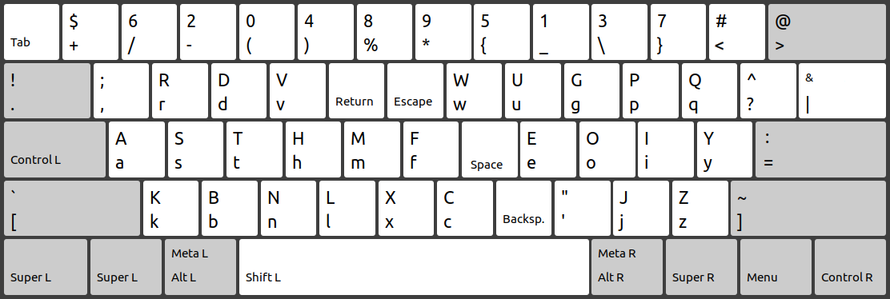

# Industry

Industry is a keyboard layout designed without convention in mind.

Industry is intended for use with an ANSI keyboard, the physical layout
found on most American laptops. It is also recommended to map
`<super-a>` to "Switch keyboard layout," as this logical keybinding has
the same physical keybinding in Industry, QWERTY, and every popular
alternative English keyboard layout.

This layout is still in beta and may change slightly in the future.

## Files

`industry.map.gz` is a kernel keymap, loadable with `loadkeys`.

`industry` is an X11 keymap.
